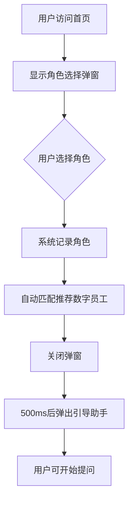
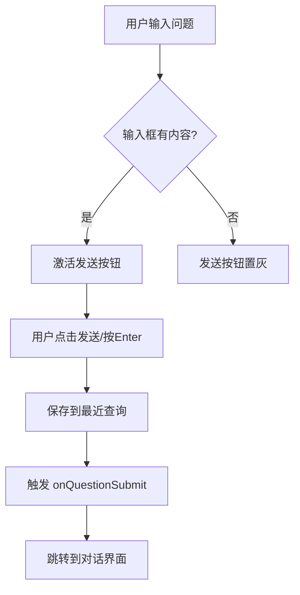
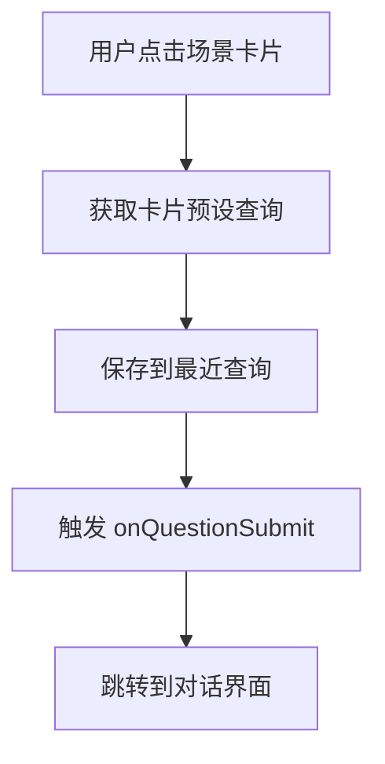
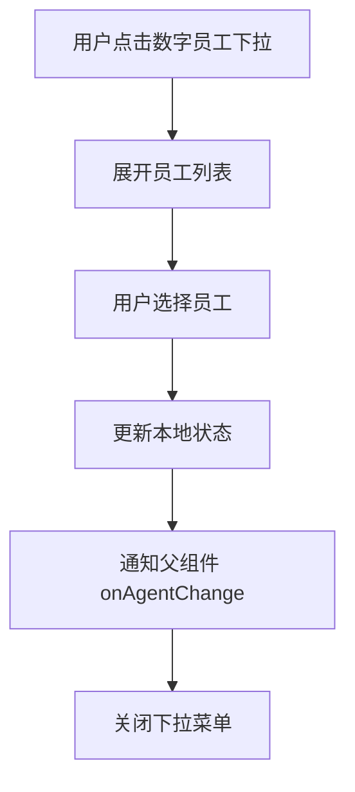
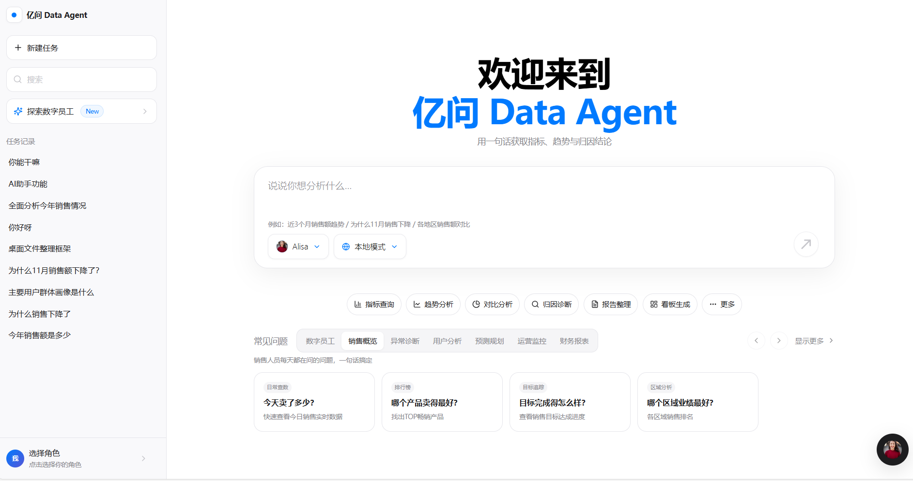
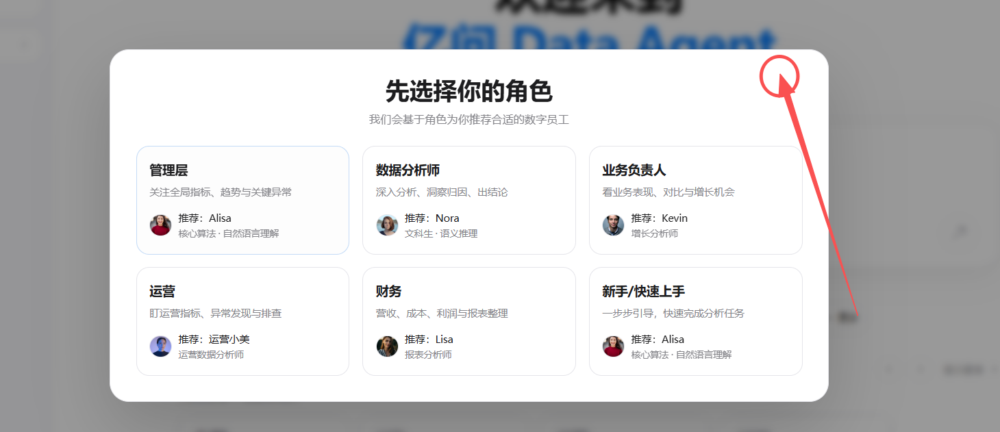

# 亿问 Data Agent 首页 PRD 文档

> **版本**：v2.0  
> **最后更新**：2026-02-04  
> **产品负责人**：[待填写]  
> **设计参考**：Apple Design System + MiniMax

---

## 一、产品概述

### 1.1 产品定位

**亿问 Data Agent** 是一款面向企业用户的智能数据分析助手平台，通过自然语言交互让用户快速获取指标、趋势与归因结论。产品核心理念是"用一句话获取数据洞察"。

### 1.2 设计理念

- **简约至上**：参考 Apple 设计语言，追求极简、优雅的视觉体验
- **智能引导**：基于用户角色智能推荐数字员工和分析场景
- **低门槛**：新手也能快速上手，一句话完成复杂分析

### 1.3 核心价值主张

| 价值点 | 说明 |
|--------|------|
| 自然语言查询 | 无需学习SQL，用业务语言提问 |
| 智能角色匹配 | 根据用户角色推荐最适合的数字员工 |
| 场景化引导 | 覆盖销售、运营、财务等核心业务场景 |
| 多模态输出 | 文字结论 + 可视化图表 + 报表生成 |

---

## 二、目标用户

### 2.1 用户角色定义

| 角色 | 描述 | 核心诉求 | 推荐数字员工 |
|------|------|----------|--------------|
| **管理层** | 关注全局指标、趋势与关键异常 | 快速获取KPI、发现问题 | Alisa（自然语言理解） |
| **数据分析师** | 深入分析、洞察归因、出结论 | 复杂分析、多维归因 | Nora（语义推理） |
| **业务负责人** | 看业务表现、对比与增长机会 | 业绩对比、增长洞察 | Kevin（增长分析师） |
| **运营** | 盯运营指标、异常发现与排查 | 日常监控、异常预警 | 运营小美（运营数据分析师） |
| **财务** | 营收、成本、利润与报表整理 | 财务报表、成本分析 | Lisa（报表分析师） |
| **新手/快速上手** | 一步步引导，快速完成分析任务 | 简单易用、引导清晰 | Alisa（最简单易用） |

### 2.2 用户旅程

```
进入首页 → 选择角色 → 系统推荐数字员工 → 输入问题/选择场景 → 获取分析结果
```

---

## 三、页面结构与布局

### 3.1 整体布局（三栏式）

```
┌─────────────────────────────────────────────────────────────────┐
│  左侧边栏 (280px)  │           主内容区 (flex-1)                 │
│                    │                                             │
│  ┌──────────────┐  │    ┌─────────────────────────────────┐     │
│  │ Logo + 标题  │  │    │         欢迎标题区               │     │
│  ├──────────────┤  │    │    "欢迎来到 亿问 Data Agent"   │     │
│  │ + 新建任务   │  │    └─────────────────────────────────┘     │
│  │ 🔍 搜索      │  │                                             │
│  │ ✨ 探索数字员工│  │    ┌─────────────────────────────────┐     │
│  ├──────────────┤  │    │         智能输入框               │     │
│  │ 任务记录     │  │    │  "说说你想分析什么…"            │     │
│  │ - 你能干嘛   │  │    │  [Alisa ▼] [本地模式 ▼]    [→]  │     │
│  │ - AI助手功能 │  │    └─────────────────────────────────┘     │
│  │ - 全面分析…  │  │                                             │
│  │ - ...        │  │    ┌─────────────────────────────────┐     │
│  ├──────────────┤  │    │       能力胶囊 (Capability Pills)│     │
│  │ 选择角色     │  │    │ [指标查询] [趋势分析] [对比分析] │     │
│  │ 👤 管理层    │  │    │ [归因诊断] [报告整理] [看板生成] │     │
│  └──────────────┘  │    └─────────────────────────────────┘     │
│                    │                                             │
│                    │    ┌─────────────────────────────────┐     │
│                    │    │     场景Tab + 问题卡片区         │     │
│                    │    │ [数字员工][销售概览][异常诊断]...│     │
│                    │    │  ┌────┐ ┌────┐ ┌────┐ ┌────┐   │     │
│                    │    │  │卡片│ │卡片│ │卡片│ │卡片│   │     │
│                    │    │  └────┘ └────┘ └────┘ └────┘   │     │
│                    │    └─────────────────────────────────┘     │
│                    │                                      🤖     │
│                    │                              (浮动引导助手) │
└─────────────────────────────────────────────────────────────────┘
```

### 3.2 响应式适配

| 断点 | 布局调整 |
|------|----------|
| ≥1024px (lg) | 显示左侧边栏，三栏布局 |
| <1024px | 隐藏左侧边栏，单栏布局 |
| 移动端 | 全屏主内容区，底部浮动助手 |

---

## 四、功能模块详解

### 4.1 左侧边栏 (Sidebar)

#### 4.1.1 Logo 区域
- **组成**：蓝色圆点图标 + "亿问 Data Agent" 文字
- **样式**：`h-14`, 白色背景带边框的图标容器

#### 4.1.2 新建任务按钮
- **功能**：清空输入框，聚焦到输入区
- **样式**：白色背景，圆角边框，带 `+` 图标
- **交互**：hover 时边框变蓝色调

#### 4.1.3 搜索框
- **功能**：搜索任务记录
- **样式**：左侧搜索图标，圆角输入框
- **交互**：聚焦时蓝色边框 + 阴影

#### 4.1.4 探索数字员工入口
- **功能**：滚动到主内容区的数字员工展示区
- **样式**：带 `✨` 图标 + "New" 标签
- **交互**：点击平滑滚动

#### 4.1.5 任务记录列表
- **数据源**：
  - 固定任务：`你能干嘛`、`AI助手功能`、`完整分析`、`你好呀`、`桌面文件整理框架`
  - 最近查询：存储在 `localStorage`，最多保留6条
- **去重逻辑**：基于 query 字段去重
- **搜索过滤**：支持关键词过滤
- **最大显示**：10条

#### 4.1.6 角色选择入口
- **位置**：侧边栏底部
- **显示**：用户头像 + 角色名称 + 角色描述
- **功能**：点击打开角色选择弹窗

---

### 4.2 主内容区

#### 4.2.1 欢迎标题区

**原型截图位置**：页面顶部居中

```
┌─────────────────────────────────────┐
│           欢迎来到                    │  ← 黑色，4xl-6xl 字号
│       亿问 Data Agent                │  ← 蓝色(#007AFF)，4xl-6xl 字号
│  用一句话获取指标、趋势与归因结论       │  ← 灰色(#86868B)，14px
└─────────────────────────────────────┘
```

**样式规范**：
- 主标题字号：`text-4xl sm:text-5xl md:text-6xl`
- 字重：`font-semibold`
- 字间距：`tracking-[-0.02em]`
- 行高：`leading-[1.08]`

---

#### 4.2.2 智能输入框

**原型截图位置**：欢迎标题下方

```
┌──────────────────────────────────────────────────────┐
│  说说你想分析什么…                                     │
│                                                      │
│  例如：近3个月销售额趋势 / 为什么11月销售下降 / 各地区… │
│                                                      │
│  [👤 Alisa ▼]  [🌐 本地模式 ▼]                   [→] │
└──────────────────────────────────────────────────────┘
```

**组件结构**：

| 元素 | 说明 | 交互 |
|------|------|------|
| 输入框 | 多行文本框，自动调整高度 | Enter 发送，Shift+Enter 换行 |
| 示例提示 | 灰色小字，引导用户输入 | 静态展示 |
| 数字员工选择器 | 下拉选择当前对话的AI员工 | 点击展开员工列表 |
| 联网模式选择器 | 切换本地/联网模式 | 点击展开选项 |
| 发送按钮 | 圆形箭头按钮 | 有内容时激活变蓝 |

**数字员工下拉菜单**：
```
┌────────────────────────────┐
│ [头像] Alisa                │ ← 当前选中（蓝色背景）
│        核心算法·自然语言理解 │
├────────────────────────────┤
│ [头像] Nora                 │
│        文科生·语义推理       │
├────────────────────────────┤
│ [头像] Kevin                │
│        增长分析师            │
│ ...                        │
└────────────────────────────┘
```

**联网模式下拉菜单**：
```
┌────────────────────────────┐
│ 本地模式                    │ ← 选中时蓝点标记
│ 使用本地数据                │
├────────────────────────────┤
│ 联网搜索                    │
│ 搜索最新信息                │
└────────────────────────────┘
```

---

#### 4.2.3 能力胶囊区 (Capability Pills)

**原型截图位置**：输入框下方

```
[📊 指标查询] [📈 趋势分析] [📉 对比分析] [🔍 归因诊断] [📄 报告整理] [📊 看板生成] [··· 更多]
```

**能力列表**：

| ID | 名称 | 图标 | 默认查询 |
|----|------|------|----------|
| cap-overview | 指标查询 | BarChart3 | "今年销售额是多少" |
| cap-trend | 趋势分析 | LineChart | "近3个月销售额趋势" |
| cap-compare | 对比分析 | PieChart | "各地区销售额对比" |
| cap-attribution | 归因诊断 | Search | "为什么11月销售额下降了？" |
| cap-report | 报告整理 | FileText | "帮我看看销售额和订单量" |
| cap-dashboard | 看板生成 | LayoutDashboard | "帮我生成一个销售分析看板" |
| cap-more | 更多 | MoreHorizontal | 展开更多能力 |

**更多能力（展开后）**：

| ID | 名称 | 默认查询 |
|----|------|----------|
| cap-metric-define | 口径解释 | "解释一下销售额这个指标的口径" |
| cap-anomaly-detect | 异常检测 | "检测销售额不正常的区域" |
| cap-composition | 构成分析 | "各品类销售额构成" |
| cap-dashboard-plan | 看板规划 | "给我一个销售看板的结构建议" |

---

#### 4.2.4 场景Tab + 问题卡片区

**原型截图位置**：能力胶囊下方

**Tab 列表**：

| Tab ID | 名称 | 说明文案 |
|--------|------|----------|
| digital_employees | 数字员工 | 围绕核心KPI、把趋势、结构、对比一次看清 |
| sales_overview | 销售概览 | 销售人员每天都在问的问题，一句话搞定 |
| anomaly_diagnosis | 异常诊断 | 数据出了问题？快速定位原因、给出建议 |
| user_analysis | 用户分析 | 了解你的用户，发现增长机会 |
| forecast_planning | 预测规划 | 用数据辅助决策，规划未来 |
| operation_monitor | 运营监控 | 每日必看的运营数据，异常早发现 |
| financial_report | 财务报表 | 财务数据一目了然，报表自动生成 |

**销售概览场景卡片示例**：

```
┌─────────────────┐  ┌─────────────────┐  ┌─────────────────┐  ┌─────────────────┐
│ 日常查数         │  │ 排行榜           │  │ 目标追踪         │  │ 区域分析         │
│ 今天卖了多少？   │  │ 哪个产品卖得最好？│  │ 目标完成得怎么样？│  │ 哪个区域业绩最好？│
│ 快速查看今日销售 │  │ 找出TOP畅销产品   │  │ 查看销售目标达成  │  │ 各区域销售排名    │
│ 实时数据         │  │                  │  │ 进度             │  │                  │
└─────────────────┘  └─────────────────┘  └─────────────────┘  └─────────────────┘
```

**完整场景问题列表**：

<details>
<summary>销售概览 (sales_overview)</summary>

| 标签 | 问题 | 描述 | 查询语句 |
|------|------|------|----------|
| 日常查数 | 今天卖了多少？ | 快速查看今日销售实时数据 | 今天销售额是多少 |
| 排行榜 | 哪个产品卖得最好？ | 找出TOP畅销产品 | TOP10畅销产品是哪些 |
| 目标追踪 | 目标完成得怎么样？ | 查看销售目标达成进度 | 本月销售目标完成率 |
| 区域分析 | 哪个区域业绩最好？ | 各区域销售排名 | 各区域销售额排名 |

</details>

<details>
<summary>异常诊断 (anomaly_diagnosis)</summary>

| 标签 | 问题 | 描述 | 查询语句 |
|------|------|------|----------|
| 下滑诊断 | 为什么销售突然下降？ | 诊断销售下滑的根本原因 | 上周销售额下降的原因是什么 |
| 问题定位 | 哪里出了问题？ | 定位异常发生的具体维度 | 哪个渠道转化率异常 |
| 库存预警 | 库存是不是有问题？ | 检查库存预警情况 | 哪些产品库存告急 |
| 退货分析 | 退货率为什么变高？ | 分析退货率上升原因 | 退货率上升的原因 |

</details>

<details>
<summary>用户分析 (user_analysis)</summary>

| 标签 | 问题 | 描述 | 查询语句 |
|------|------|------|----------|
| 用户画像 | 用户都是谁？ | 了解核心用户画像 | 主要用户群体画像是什么 |
| VIP识别 | 高价值客户有哪些？ | 识别VIP客户群体 | 高价值客户有哪些特征 |
| 流失预警 | 用户为什么流失？ | 分析用户流失原因 | 近期用户流失的主要原因 |
| 获客分析 | 新用户从哪来？ | 追踪新用户来源渠道 | 新用户主要来源渠道 |

</details>

<details>
<summary>预测规划 (forecast_planning)</summary>

| 标签 | 问题 | 描述 | 查询语句 |
|------|------|------|----------|
| 销售预测 | 下个月能卖多少？ | 预测下月销售趋势 | 预测下个月销售额 |
| 目标分解 | 年度目标怎么分解？ | 将目标拆解到季度/月 | 年度目标如何分解到各月 |
| 库存规划 | 备货备多少合适？ | 预测库存需求量 | 下季度需要备多少库存 |
| 价格模拟 | 调价会有什么影响？ | 模拟价格调整效果 | 涨价5%对销量有什么影响 |

</details>

<details>
<summary>运营监控 (operation_monitor)</summary>

| 标签 | 问题 | 描述 | 查询语句 |
|------|------|------|----------|
| 健康检查 | 今天数据正常吗？ | 快速检查今日核心指标 | 今天各项指标是否正常 |
| 告警中心 | 有什么需要关注的？ | 查看今日异常告警 | 今天有什么异常需要关注 |
| 日环比 | 比昨天怎么样？ | 对比昨日数据变化 | 今天比昨天表现如何 |
| 活动追踪 | 活动效果怎么样？ | 追踪营销活动效果 | 这次促销活动效果如何 |

</details>

<details>
<summary>财务报表 (financial_report)</summary>

| 标签 | 问题 | 描述 | 查询语句 |
|------|------|------|----------|
| 利润查询 | 这个月赚了多少？ | 查看本月利润情况 | 本月净利润是多少 |
| 成本明细 | 钱都花在哪了？ | 分析成本支出明细 | 本月各项成本支出明细 |
| 毛利分析 | 毛利率是多少？ | 查看毛利率及变化 | 各产品线毛利率是多少 |
| 报表生成 | 帮我出份月报 | 自动生成财务简报 | 帮我生成本月财务月报 |

</details>

---

### 4.3 角色选择弹窗

**原型截图位置**：首次进入时全屏遮罩弹窗

```
┌─────────────────────────────────────────────────────────────────┐
│                                                           [X]   │
│                     先选择你的角色                               │
│              我们会基于角色为你推荐合适的数字员工                   │
│                                                                 │
│  ┌─────────────┐  ┌─────────────┐  ┌─────────────┐              │
│  │ 管理层       │  │ 数据分析师   │  │ 业务负责人   │              │
│  │ 关注全局指标  │  │ 深入分析、洞察│ │ 看业务表现   │              │
│  │ 趋势与关键异常│  │ 归因、出结论  │  │ 对比与增长机会│              │
│  │              │  │              │  │              │              │
│  │ [头像] Alisa │  │ [头像] Nora  │  │ [头像] Kevin │              │
│  │ 核心算法·自然 │  │ 文科生·语义   │  │ 增长分析师   │              │
│  │ 语言理解      │  │ 推理         │  │              │              │
│  └─────────────┘  └─────────────┘  └─────────────┘              │
│                                                                 │
│  ┌─────────────┐  ┌─────────────┐  ┌─────────────┐              │
│  │ 运营         │  │ 财务         │  │ 新手/快速上手 │              │
│  │ 盯运营指标、  │  │ 营收、成本、  │  │ 一步步引导，  │              │
│  │ 异常发现与排查│  │ 利润与报表整理│  │ 快速完成分析  │              │
│  │              │  │              │  │ 任务         │              │
│  │ [头像]运营小美│  │ [头像] Lisa  │  │ [头像] Alisa │              │
│  │ 运营数据分析师│  │ 报表分析师   │  │ 核心算法·自然 │              │
│  │              │  │              │  │ 语言理解      │              │
│  └─────────────┘  └─────────────┘  └─────────────┘              │
└─────────────────────────────────────────────────────────────────┘
```

**角色选择后的系统行为**：
1. 设置用户角色状态
2. 自动选择该角色推荐的首选数字员工
3. 关闭弹窗
4. 500ms 后触发右下角浮动引导助手

---

### 4.4 浮动引导助手

**原型截图位置**：页面右下角

**组件特性**：
- 显示当前选中数字员工的头像
- 点击展开引导问题列表
- 角色选择后自动展开（`autoOpen` 触发）
- 根据用户角色显示个性化引导内容

---

## 五、交互流程

### 5.1 首次访问流程



### 5.2 提问交互流程



### 5.3 场景卡片点击流程



### 5.4 数字员工切换流程



---

## 六、UI 规范

### 6.1 色彩系统

| 用途 | 色值 | 说明 |
|------|------|------|
| 主色 | `#007AFF` | Apple 蓝，用于强调、按钮、选中态 |
| 文字主色 | `#1D1D1F` | 深黑色，用于标题和主要文字 |
| 文字次色 | `#86868B` | 灰色，用于描述和次要文字 |
| 占位符色 | `#8E8E93` | 浅灰色，用于输入框占位符 |
| 禁用色 | `#C7C7CC` | 最浅灰，用于禁用态 |
| 边框色 | `#E5E5EA` | 浅灰边框 |
| 背景色 | `#F9F9FB` | 侧边栏背景 |
| 悬停背景 | `#F5F5F7` | hover 状态背景 |
| 选中背景 | `#F0F7FF` | 蓝色选中背景 |

### 6.2 字体规范

| 类型 | 字号 | 字重 | 用途 |
|------|------|------|------|
| 大标题 | `text-4xl ~ text-6xl` | `font-semibold` | 欢迎标题 |
| 中标题 | `text-2xl ~ text-3xl` | `font-semibold` | 弹窗标题 |
| 正文 | `text-[16px]` | `font-light` | 输入框文字 |
| 按钮文字 | `text-[13px]` | `font-medium` | 按钮、Tab |
| 描述文字 | `text-[12px]` | `font-normal` | 次要说明 |
| 标签文字 | `text-[11px]` | `font-normal` | 最小标签 |

### 6.3 圆角规范

| 元素 | 圆角值 |
|------|--------|
| 大卡片/弹窗 | `rounded-3xl` (24px) |
| 中卡片 | `rounded-2xl` (16px) |
| 按钮/输入框 | `rounded-xl` (12px) |
| 胶囊按钮 | `rounded-full` |
| 头像 | `rounded-full` |

### 6.4 阴影规范

| 类型 | 阴影值 | 用途 |
|------|--------|------|
| 轻阴影 | `shadow-[0_1px_3px_rgba(0,0,0,0.04)]` | 按钮 |
| 中阴影 | `shadow-[0_10px_40px_rgba(0,0,0,0.06)]` | 输入框 |
| 重阴影 | `shadow-[0_30px_80px_rgba(0,0,0,0.18)]` | 弹窗 |
| 下拉阴影 | `shadow-[0_8px_32px_rgba(0,0,0,0.12)]` | 下拉菜单 |

### 6.5 动画规范

| 元素 | 动画类型 | 参数 |
|------|----------|------|
| 页面入场 | fade + slide up | `duration: 0.7s, ease: [0.16, 1, 0.3, 1]` |
| 弹窗入场 | scale + fade | `scale: 0.96 → 1, opacity: 0 → 1` |
| 按钮点击 | scale | `active:scale-95` |
| hover 过渡 | all | `transition-all duration-200` |

---

## 七、状态管理

### 7.1 组件状态

| 状态 | 类型 | 默认值 | 说明 |
|------|------|--------|------|
| `inputValue` | string | `''` | 输入框内容 |
| `selectedAgentId` | string | `agent.id` | 当前选中的数字员工 |
| `enableWebSearch` | boolean | `false` | 是否开启联网搜索 |
| `showAgentDropdown` | boolean | `false` | 员工下拉是否展开 |
| `showWebSearchDropdown` | boolean | `false` | 联网模式下拉是否展开 |
| `showGuidePanel` | boolean | `false` | 引导面板是否显示 |
| `recentQueries` | string[] | localStorage | 最近查询记录 |
| `activeScenarioTab` | ScenarioTab | `'digital_employees'` | 当前场景Tab |
| `showMoreCapabilities` | boolean | `false` | 是否展开更多能力 |
| `showMoreEmployees` | boolean | `false` | 是否展开更多员工/问题 |
| `sidebarSearch` | string | `''` | 侧边栏搜索关键词 |
| `showRolePicker` | boolean | `true` | 角色选择弹窗是否显示 |
| `userRole` | RoleOption \| null | `null` | 用户选择的角色 |
| `triggerGuideAfterRole` | boolean | `false` | 是否触发引导助手展开 |

### 7.2 本地存储

| Key | 说明 | 格式 |
|-----|------|------|
| `yiwen_recent_queries_v1` | 最近查询记录 | JSON 数组，最多6条 |

---

## 八、组件依赖

### 8.1 外部依赖

| 库 | 版本 | 用途 |
|----|------|------|
| React | 18.x | 核心框架 |
| framer-motion | 10.x | 动画效果 |
| lucide-react | latest | 图标库 |

### 8.2 内部组件

| 组件 | 路径 | 用途 |
|------|------|------|
| EnhancedGuidePanel | `./EnhancedGuidePanel` | 增强引导面板 |
| FloatingGuideAssistant | `./FloatingGuideAssistant` | 浮动引导助手 |

### 8.3 数据依赖

| 数据 | 来源 | 说明 |
|------|------|------|
| AGENTS | `../services/agents/index` | 所有数字员工列表 |
| AgentProfile | `../types` | 员工类型定义 |

---

## 九、接口定义

### 9.1 Props 接口

```typescript
interface SimpleInputPageProps {
  // 提交问题的回调
  onQuestionSubmit: (
    question: string, 
    options?: { 
      agentId?: string; 
      enableWebSearch?: boolean 
    }
  ) => void;
  
  // 当前数字员工
  agent: AgentProfile;
  
  // 切换数字员工的回调
  onAgentChange?: (agentId: string) => void | Promise<void>;
  
  // 当前数字员工ID（用于同步）
  currentAgentId?: string;
}
```

### 9.2 角色选项接口

```typescript
interface RoleOption {
  id: string;           // 角色ID
  label: string;        // 角色名称
  description: string;  // 角色描述
  recommendedAgents: RoleAgentRecommendation[];  // 推荐员工列表
}

interface RoleAgentRecommendation {
  agentId: string;   // 员工ID
  reason: string;    // 推荐原因
  priority: number;  // 优先级（越小越靠前）
}
```

---

## 十、原型截图参考

### 10.1 首页完整视图



*图示说明：展示了完整的首页布局，包括左侧边栏、欢迎标题、输入框、能力胶囊和场景卡片*

### 10.2 角色选择弹窗



*图示说明：首次进入时显示的角色选择弹窗，6个角色卡片，每个卡片显示角色名称、描述和推荐的数字员工*

### 10.3 数字员工选择


*图示说明：点击输入框内的员工选择器后展开的下拉菜单*

---

## 十一、未来规划

### 11.1 短期优化
- [ ] 角色偏好本地持久化
- [ ] 支持快捷键操作
- [ ] 输入框智能补全

### 11.2 中期规划
- [ ] 个性化推荐算法优化
- [ ] 多语言支持
- [ ] 暗色主题

### 11.3 长期愿景
- [ ] 语音输入支持
- [ ] 移动端原生体验优化
- [ ] AI 主动推荐分析任务

---

## 十二、附录

### A. 数字员工完整列表

*详见 `src/services/agents/index.ts`*

### B. 图标对照表

| 图标名 | 用途 |
|--------|------|
| BarChart3 | 指标查询 |
| LineChart | 趋势分析 |
| PieChart | 对比分析/构成分析 |
| Search | 归因诊断/异常检测 |
| FileText | 报告整理/口径解释 |
| LayoutDashboard | 看板生成/看板规划 |
| Globe | 联网模式 |
| Sparkles | 探索数字员工 |
| Plus | 新建任务 |
| ChevronDown | 下拉指示 |
| ChevronLeft/Right | 左右滚动 |
| X | 关闭按钮 |
| Lightbulb | 推荐提示 |
| MoreHorizontal | 更多选项 |

---

*文档结束*
